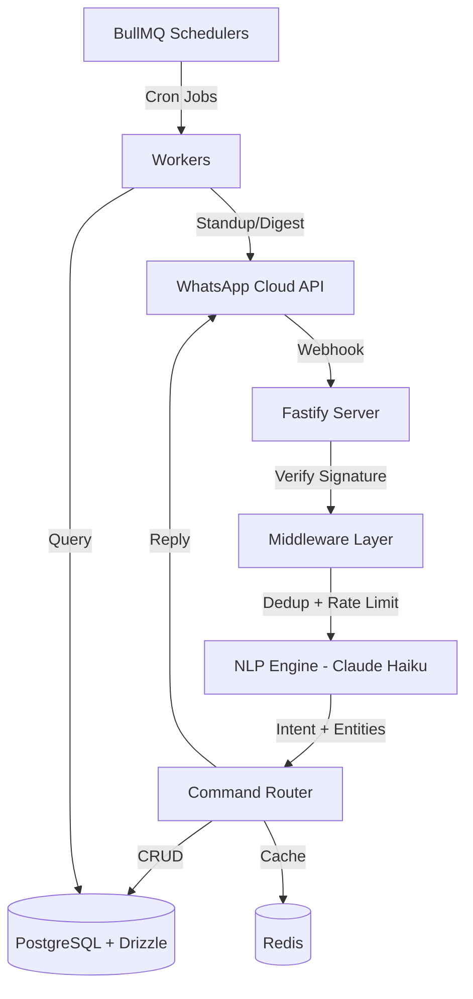

# WAPA — WhatsApp Project Management Assistant

A lightweight, conversational project management tool that lives entirely inside WhatsApp. No app downloads. No onboarding funnels. No dashboards to learn. Text it like a coworker, and it manages your projects.

## Architecture



## Features

| Feature | Example Message | What Happens |
|---------|----------------|--------------|
| Create task | "add task: design the landing page" | ✅ Task created with smart defaults |
| Assign task | "assign landing page to @sarah" | Reassigns + notifies |
| List tasks | "what's on my plate?" | Numbered list with due dates |
| Complete task | "done with landing page" | Marks done + progress update |
| Sprint status | "how's the sprint?" | Progress bar + summary |
| Set due date | "push landing page to next tuesday" | Updates with confirmation |
| Set priority | "landing page is urgent" | Bumps priority with emoji |
| Add note | "note: client wants blue not green" | Attached to relevant task |
| Block/unblock | "landing page is blocked by API" | Status change + team notification |
| Create project | "new project: Website Redesign" | Project + auto-sprint created |

## Tech Stack

| Layer | Technology |
|-------|-----------|
| Runtime | Node.js 20 (LTS) |
| Framework | Fastify 5 |
| Language | TypeScript (strict mode) |
| Database | PostgreSQL 16 + Drizzle ORM |
| Cache/Queue | Redis 7 + BullMQ |
| WhatsApp | WhatsApp Business Cloud API |
| NLP | Claude 3.5 Haiku |
| Testing | Vitest + Supertest |
| CI/CD | GitHub Actions |
| Monitoring | Sentry + Pino |

## Local Development

### Prerequisites
- Node.js 20+
- PostgreSQL 16
- Redis 7
- Meta Developer account (for WhatsApp API)
- Anthropic API key

### Setup

```bash
cd wapa
npm install

# Configure environment
cp .env.example .env
# Edit .env with your credentials

# Run database migrations
npm run db:migrate

# Seed development data
npm run db:seed

# Start development server
npm run dev
```

### Environment Variables

| Variable | Description | Required |
|----------|-------------|----------|
| `DATABASE_URL` | PostgreSQL connection string | Yes |
| `REDIS_URL` | Redis connection string | Yes |
| `WHATSAPP_PHONE_NUMBER_ID` | Meta phone number ID | Yes |
| `WHATSAPP_BUSINESS_ACCOUNT_ID` | Meta business account ID | Yes |
| `WHATSAPP_ACCESS_TOKEN` | Meta API access token | Yes |
| `WHATSAPP_VERIFY_TOKEN` | Custom webhook verify token | Yes |
| `WHATSAPP_APP_SECRET` | Meta app secret for signature verification | Yes |
| `ANTHROPIC_API_KEY` | Claude API key | Yes |
| `SENTRY_DSN` | Sentry error tracking | No |
| `PORT` | Server port (default: 3000) | No |
| `LOG_LEVEL` | Pino log level (default: info) | No |

### Scripts

```bash
npm run dev          # Start with hot reload
npm run build        # Build for production
npm run start        # Start production server
npm test             # Run tests
npm run test:watch   # Watch mode
npm run lint         # ESLint
npm run format       # Prettier
npm run db:migrate   # Run migrations
npm run db:seed      # Seed data
npm run db:studio    # Drizzle Studio
```

## Deployment

### Railway
```bash
# Install Railway CLI, then:
railway up
```

### Docker
```bash
docker build -t wapa .
docker run -p 3000:3000 --env-file .env wapa
```

## Documentation

- [API Documentation](docs/api.md)
- [WhatsApp Setup Guide](docs/whatsapp-setup.md)
- [NLP Tuning Guide](docs/nlp-tuning.md)
- [Launch Checklist](docs/launch-checklist.md)

## License

MIT
